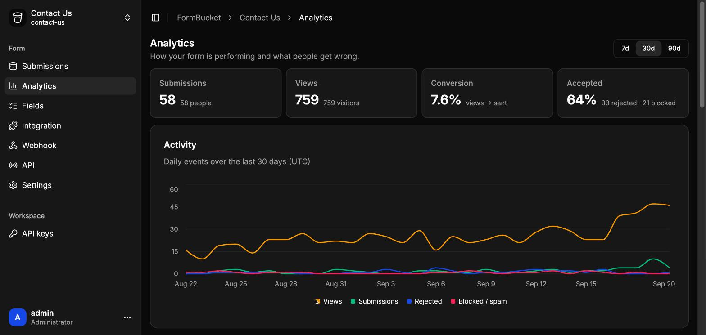
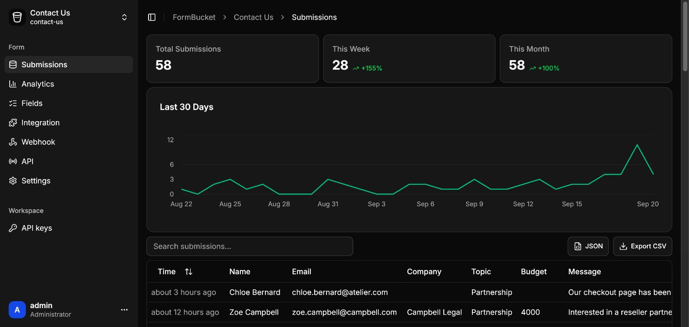
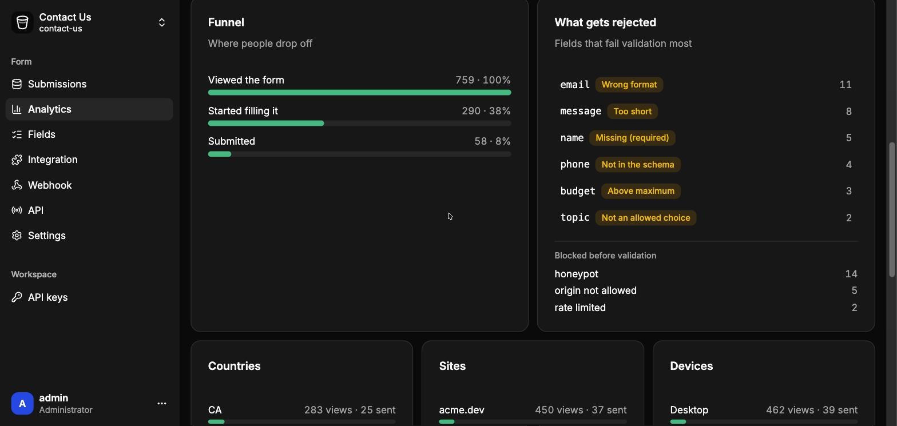
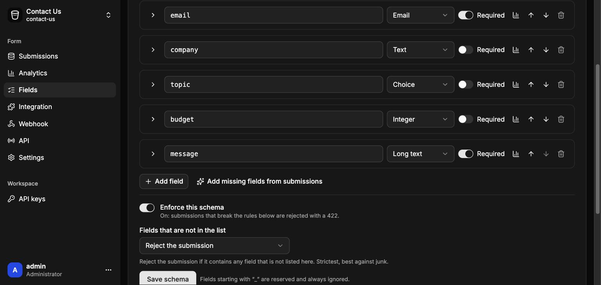
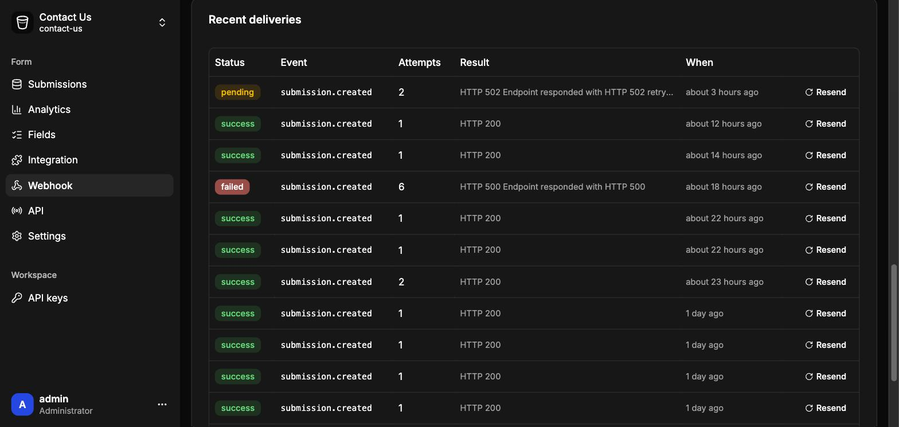
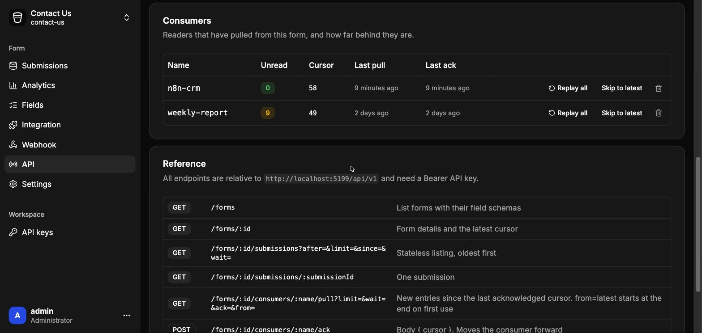

<p align="center"></p>

<h1 align="center">FormBucket</h1>

<p align="center">
Self-hosted form backend on Cloudflare Workers + D1.<br>
Collect submissions from any form, validate them, see where visitors drop off,<br>
forward them to a webhook and let your apps pull only what is new.
</p>

<p align="center">
<a href="https://deploy.workers.cloudflare.com/?url=https://github.com/momardia54/formbucket"></a>
</p>



> **Status: pre-1.0 (0.3.0).** It works and is documented, but the public API may still change and we haven't tested every way of installing it yet. What is left before 1.0.0 is in the [Roadmap](website/src/content/docs/more/roadmap.md).

## What it does

- **Form buckets:** one endpoint per form (`POST /f/<form-id>`) for HTML forms, `fetch`, cURL or servers. JSON, urlencoded or multipart.
- **Schema you control:** describe your fields; accept everything until you switch on enforcement.
- **Analytics without cookies:** views, conversion, funnel, rejections and per-field insights. Visitor IPs are never stored (only blocked addresses are, so you can undo a block).
- **Signed webhooks:** HMAC-signed JSON with a delivery log and automatic retries.
- **Pull API:** named consumers with server-side cursors, so n8n, cron jobs and scripts read only new entries. Long polling included.
- **Bot protection:** honeypot, Cloudflare Turnstile, rate limits, automatic blocking and a Blocked IPs list.
- **Runs free** on Workers, D1 and one cron trigger. The database tables create and upgrade themselves, so a deploy from the Cloudflare dashboard needs no commands.

<details>
<summary>Screenshots</summary>







</details>

## Quick start

1. **Deploy:** click **Deploy to Cloudflare** above. It creates the Worker and a D1 database named `<worker-name>-db`. Installing more than one copy in an account? Give each Worker a different name.
2. **Sign in:** open your Worker's address. Until you add the admin login as runtime secrets, the login page shows what is missing and how to add it.

   | Name | Type | Required |
   |---|---|---|
   | `ADMIN_USERNAME` | secret | yes |
   | `ADMIN_PASSWORD` | secret (12+ characters) | yes |
   | `SESSION_SECRET` | secret | recommended |
   | `DB_SUFFIX` | *build* variable | optional (custom database name) |

3. **Create a form and send data:**

   ```bash
   curl -X POST https://<your-worker>/f/contact \
     -H 'Content-Type: application/json' \
     -d '{"name":"Ada","email":"ada@example.com"}'
   ```

   Open **Submissions** in the dashboard: it is there.

## Documentation

The full documentation is in [`website/`](website) (one page per topic, built with Starlight). Start with the [Quickstart](website/src/content/docs/getting-started/quickstart.md).

| | |
|---|---|
| **Getting started** | [Quickstart](website/src/content/docs/getting-started/quickstart.md) · [Deploy](website/src/content/docs/getting-started/deploy.md) · [Configuration](website/src/content/docs/getting-started/configuration.md) · [Updating](website/src/content/docs/getting-started/updating.md) |
| **Guides** | [Sending data](website/src/content/docs/guides/sending-data.md) · [Schema](website/src/content/docs/guides/schema.md) · [Spam protection](website/src/content/docs/guides/spam-protection.md) · [Analytics](website/src/content/docs/guides/analytics.md) · [Webhooks](website/src/content/docs/guides/webhooks.md) · [Pull API](website/src/content/docs/guides/pull-api.md) · [Dashboard](website/src/content/docs/guides/dashboard.md) |
| **Reference** | [API endpoints](website/src/content/docs/reference/api-endpoints.md) · [Limits](website/src/content/docs/reference/limits.md) |
| **More** | [Security](website/src/content/docs/more/security.md) · [Architecture](website/src/content/docs/more/architecture.md) · [Troubleshooting](website/src/content/docs/more/troubleshooting.md) · [Development](website/src/content/docs/more/development.md) · [Roadmap to 1.0](website/src/content/docs/more/roadmap.md) |

What changed in each version: [CHANGELOG.md](CHANGELOG.md).

## Development

```bash
cp .dev.vars.example .dev.vars   # set ADMIN_USERNAME / ADMIN_PASSWORD
npm install
npm run dev                      # local D1 + Vite on :5173
npm test                         # unit tests
```

Running the docs site, editing pages and deploying it separately from the app: [Documentation site](website/src/content/docs/more/docs-site.md). Docs are part of every change: update the matching page (and the changelog) in the same commit.

## License

MIT. The dashboard UI kit is derived from [FormZero](https://github.com/BohdanPetryshyn/formzero) (MIT). See [LICENSE](LICENSE).
